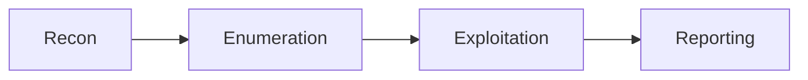

  

  

  

  

<strong style="color:#FF4D4D">I break things so others can build them better.</strong>

  
  
  

--

## About
- Cybersecurity student focused on practical web application pentesting and security research.  
- I build automation and tools that scale recon and analysis workflows.  
- Confident, disciplined, and learning continuously (HTB CPTS — in progress; Top 5% TryHackMe).

--

## Tech Stack

  
  
  
  
  
  

  
  
  
  

  
  

--

## Current Focus
- HTB CPTS (certification path)  
- Building security tools & automation  
- CTFs — practice and writeups  
- Bug hunting and responsible disclosure

--

## Featured Projects
- [Recon Tool](#) — lightweight, fast domain & subdomain reconnaissance (placeholder).  
- [API Security Scanner](#) — focused checks for common API misconfigurations (placeholder).  
- [Security Automation](#) — orchestration for repeatable test pipelines (placeholder).  
- [CTF Writeups](#) — curated walkthroughs and tooling notes (placeholder).

--

## Methodology

---

## Achievements
- [HTB CPTS] — in progress.  
- Top 5% on TryHackMe.  
- Multiple accepted responsible disclosures (private).  

---

## Contact
- GitHub: https://github.com/penielmelaku  
- LinkedIn: https://www.linkedin.com/in/peniel-melaku-974360330  
- HackTheBox: https://app.hackthebox.com/users/2076259

--

> "The quieter you become, the more you can hear."
